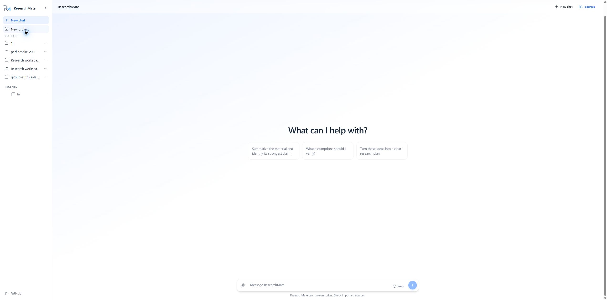
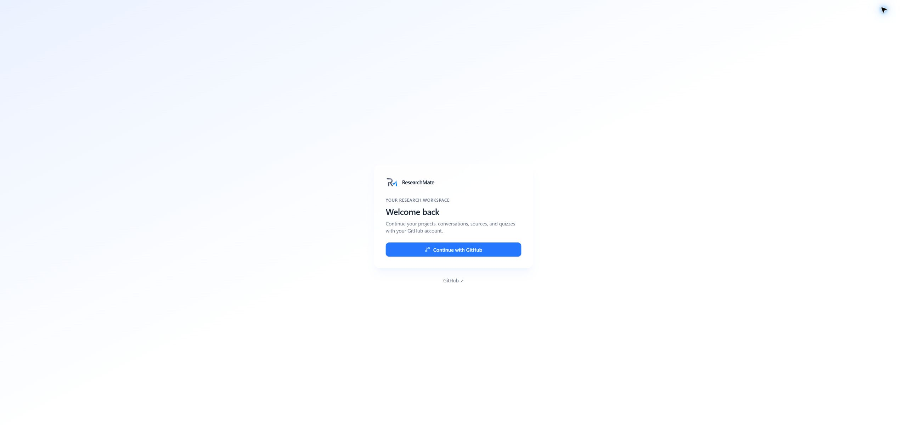
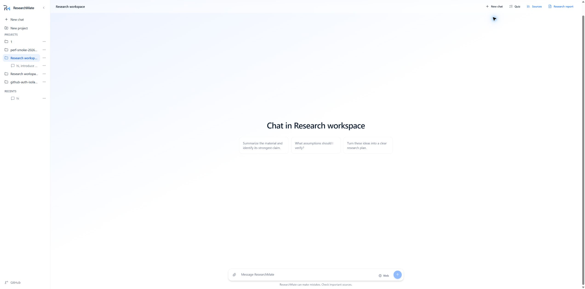
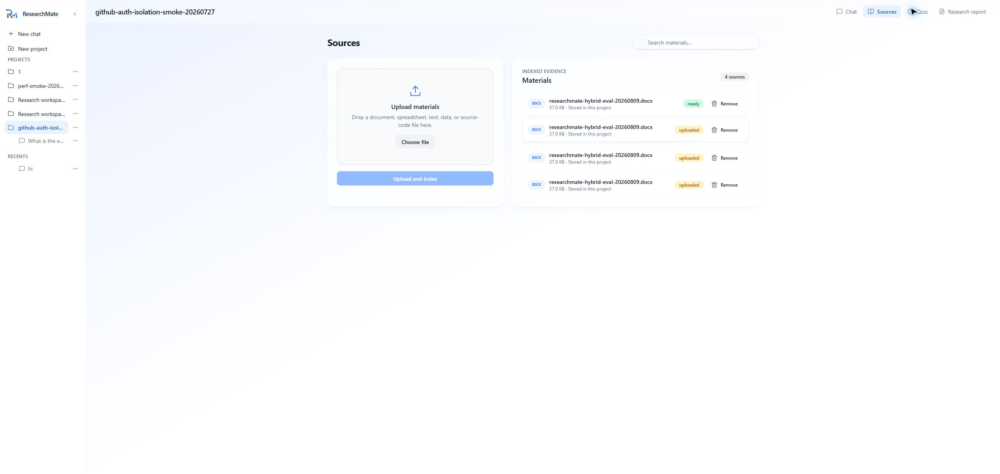
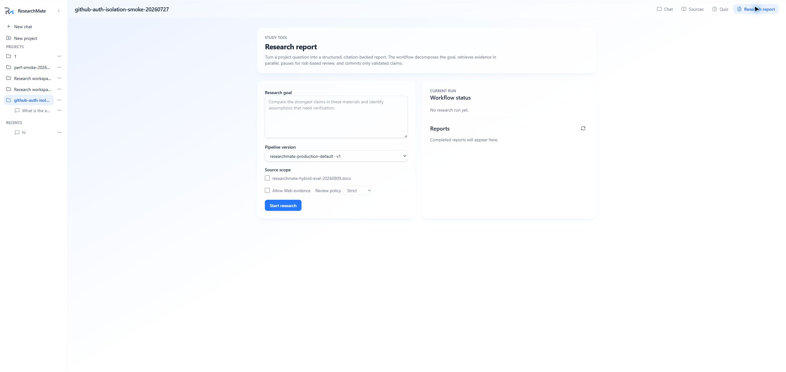

# ResearchMate

> 面向多文档证据审查的研究工作台：以引用为核心，结合混合检索与可恢复的 Agent 工作流。

[在线体验](https://research-mate-web.vercel.app/) · [English](./README.md) · [文档](./docs/index.zh.html) · [GitHub](https://github.com/LeviLian126/researchMate)

### ResearchMate 是什么？

ResearchMate 将一个有边界的研究问题和一组来源文档，转化为可审查、带引用的研究结果。

系统组合了：

- 支持项目、对话、来源和研究运行的 ChatGPT 风格工作区；
- Wiki/Overview 辅助定位与 Dense/Sparse 混合检索；
- 证据提取、声明关系对账、带引用报告综合和增量刷新；
- 基于 LangGraph 的编排、PostgreSQL Checkpoint，以及风险节点的人机协同审核；
- 版本化 RAG 评测、Bad Case 回归和可追踪的运行记录。

### 产品导览

<p align="center">
  
</p>

在统一工作区发起对话、添加文件或启用 Web 证据。项目和最近对话集中在侧边栏，随时可以继续。

<table>
  <tr>
    <td width="50%">
      
      <br><strong>GitHub 登录</strong><br>
      通过统一的 GitHub 认证入口进入在线工作区。
    </td>
    <td width="50%">
      
      <br><strong>项目工作区</strong><br>
      将项目对话、来源、测验和研究报告放在同一范围内。
    </td>
  </tr>
  <tr>
    <td width="50%">
      
      <br><strong>可索引的来源库</strong><br>
      上传文档并检查摄取状态，再将其作为回答和研究的证据。
    </td>
    <td width="50%">
      
      <br><strong>可恢复的研究流程</strong><br>
      设置研究目标、来源范围、Web 和审核策略，然后跟踪报告运行。
    </td>
  </tr>
</table>

### 为什么要做它

长时间研究任务会遇到供应商超时、证据不完整、结论矛盾、进程重启和来源变化。单次同步 LLM 调用无法安全地拥有这些状态。ResearchMate 将它们建模为明确的领域状态，并持久化证据、决策、报告和恢复 Checkpoint，使任务可以被审查、恢复或拒绝，而不是静默地产生一个看似成功的答案。

### 核心流程

```text
研究问题 + 来源范围
        │
        ▼
  拆分有边界的子问题
        │
        ├── 并行检索本地/Web 证据
        ├── 提取声明和精确引用
        ├── 对账支持 / 矛盾 / 重复关系
        ├── 按策略暂停并等待人工审核
        ├── 综合已验证的报告章节
        └── 持久化运行、证据、成本、Trace 和 Checkpoint
```

### 技术亮点

- **Wiki + Hybrid RAG**：按文档生成 Wiki/Overview 辅助上下文；BM25 与 Qdrant Dense/Sparse 检索召回候选；通过 RRF、有限重排序和 Token Budget 控制最终证据集。
- **可恢复 Agent 执行**：LangGraph 拆分有边界阶段，使用 PostgreSQL Checkpoint 支持中断、批准、拒绝、重试和进程恢复。
- **证据接地输出**：声明、关系、证据快照、报告修订和引用通过类型化 Schema 与服务端白名单校验。
- **Bad Case 回归**：负反馈可以进入冻结评测集；PostgreSQL Advisory Lock 串行化数据集版本创建和可重复评测。
- **租户与数据隔离**：API 所有权检查、PostgreSQL RLS、Qdrant 项目过滤、私有对象键、短时签名 URL 和脱敏观测事件共同限制数据边界。
- **显式降级**：重排序不可用、供应商故障、不支持扫描 PDF OCR 等情况会变成可见状态或类型化错误，不伪装成成功回答。

### 技术栈

| 层 | 技术 |
| --- | --- |
| Web | Next.js、React、TypeScript、Tailwind CSS、Radix UI、Vitest、Playwright |
| API | FastAPI、Pydantic、SQLAlchemy、PostgreSQL、OpenAPI |
| 工作流 | LangGraph、Celery、Redis、PostgreSQL Checkpoint、Outbox/Dispatcher |
| 检索 | Qdrant Dense/Sparse 向量、BM25、混合融合、重排序适配器 |
| 文档 | S3 兼容对象存储、有界文本层 PDF 解析、Office/文档解析器 |
| 评测 | RAGAS 适配器、Recall/Citation/Faithfulness 指标、冻结 Bad Case 数据集 |
| 运维 | Render、Vercel、GitHub Actions、兼容 Langfuse 的脱敏 Trace |

### 仓库结构

```text
apps/api/             FastAPI 应用和领域服务
apps/web/             Next.js 应用和浏览器工作流
workers/ai-worker/    Celery Worker、摄取、检索和 LangGraph 运行时
tests/                Python 合约、服务测试和集成形态测试
infra/                Supabase 迁移、Qdrant 配置和部署资源
docs/                 产品、架构、API、数据库、前端、后端和 Worker 指南
```

### 快速开始

完整运行环境需要 Python 3.13、`uv`、Node.js、PostgreSQL、Redis、Qdrant 和 S3 兼容对象存储。

```powershell
uv sync --frozen
npm install
```

启动 API 和前端：

```powershell
npm run api:dev
npm run web:dev
```

前端确定性 Demo 和 Playwright 测试不需要云端凭据或本地数据库：

```powershell
npm run test:e2e
```

质量检查：

```powershell
npm run check:all
```

### 文档入口

- [产品范围与能力台账](./docs/product/index.zh.html)
- [架构与技术栈](./docs/architecture/index.zh.html)
- [API 合约](./docs/contracts/api/index.zh.html)
- [数据库合约](./docs/contracts/data/index.zh.html)
- [前端学习指南](./docs/learn/frontend.zh.html)
- [后端学习指南](./docs/learn/backend.zh.html)
- [Worker 与摄取指南](./docs/learn/worker.zh.html)

### 许可证

ResearchMate 使用 Apache License 2.0 开源。完整许可证文本请见 [LICENSE](./LICENSE)。
